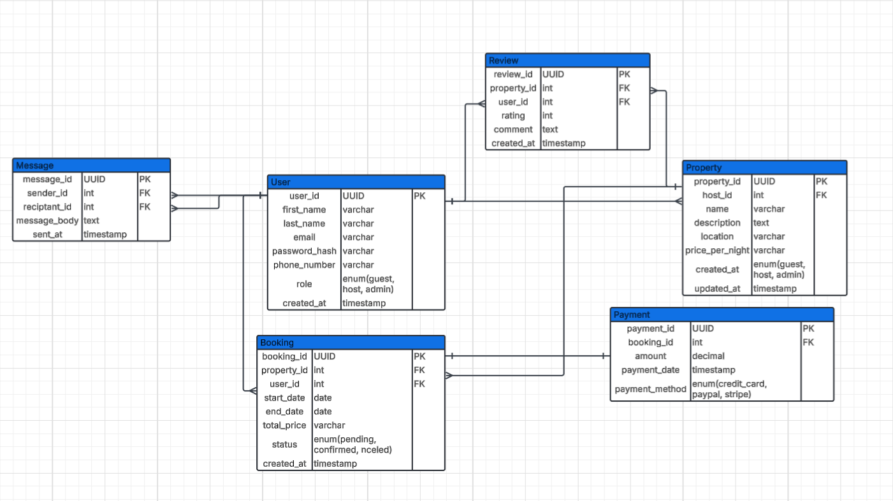

## 🏠 Airbnb Clone – Backend Features & Functionalities

This project is a backend system for an Airbnb-like booking platform. Below is a detailed breakdown of the features and modules it supports:

---

## 🔑 Core Functionalities

The backend for the Airbnb Clone project supports essential features that align with a full-fledged rental marketplace platform. Below are the key functionalities:

### 1. User Management

- **User Registration**  
  Users can register as either *guests* or *hosts* using secure methods like JWT (JSON Web Tokens).

- **User Login and Authentication**  
  Login via email and password. OAuth support for Google and Facebook is also included.

- **Profile Management**  
  Users can update their profiles, including profile pictures, contact information, and preferences.

### 2. Property Listings Management

- **Add Listings**  
  Hosts can create listings with details such as title, description, location, price, amenities, and availability.

- **Edit/Delete Listings**  
  Hosts can modify or remove their property listings.

### 3. Search and Filtering

- Search functionality allows users to find listings based on:
  - Location
  - Price range
  - Number of guests
  - Amenities (e.g., Wi-Fi, pool, pet-friendly)

- Includes pagination support for large datasets.

### 4. Booking Management

- **Booking Creation**  
  Guests can book properties for specific dates with validation to prevent double bookings.

- **Booking Cancellation**  
  Bookings can be canceled by either guests or hosts based on defined policies.

- **Booking Status Tracking**  
  Bookings have statuses such as `pending`, `confirmed`, `canceled`, and `completed`.

### 5. Payment Integration

- **Secure Payment Gateways**  
  Integrates with Stripe and PayPal for:
  - Guest payments
  - Host payouts after booking completion

- **Multi-Currency Support**  
  Allows payments in various currencies.

### 6. Reviews and Ratings

- Guests can submit reviews and ratings for properties.
- Hosts can respond to reviews.
- Reviews are linked to specific bookings to ensure authenticity.

### 7. Notifications System

- Sends **email** and **in-app** notifications for:
  - Booking confirmations
  - Cancellations
  - Payment updates

### 8. Admin Dashboard

- Admin interface for monitoring and managing:
  - Users
  - Listings
  - Bookings
  - Payments

---

## 🛠️ Technical Requirements

### 1. Database Management

- Uses a relational database (e.g., PostgreSQL or MySQL).
- Main tables include:
  - `Users` (guests and hosts)
  - `Properties`
  - `Bookings`
  - `Reviews`
  - `Payments`

### 2. API Development

- RESTful APIs expose backend services to the frontend.
- Proper usage of HTTP methods:
  - `GET`, `POST`, `PUT/PATCH`, `DELETE`
- Optional GraphQL integration for advanced data queries.

### 3. Authentication and Authorization

- Uses **JWT** for secure session management.
- Role-Based Access Control (RBAC) to differentiate:
  - Guest access
  - Host access
  - Admin access

### 4. File Storage (Scenario Based)

- Stores property images and user profile photos.
- Cloud storage solutions like **AWS S3** or **Cloudinary** are supported.  
  For implementation, local file storage will be used.

### 5. Third-Party Services

- Email services like **SendGrid** or **Mailgun** are used for sending email notifications.

### 6. Error Handling and Logging

- Implements centralized/global error handling for API endpoints.
- Logs critical errors and events for monitoring.

---

## 🚀 Non-Functional Requirements

### 1. Scalability

- Modular design for scalable architecture.
- Supports horizontal scaling via load balancers.

### 2. Security

- Encrypts sensitive data like passwords and payment details.
- Firewalls and rate limiting prevent brute force and abuse.

### 3. Performance Optimization

- Uses **Redis** caching to speed up frequent data access.
- Optimizes queries to reduce database load.

### 4. Testing

- Unit and integration tests are written using **pytest**.
- Automated API testing ensures all endpoints work as expected.

---

